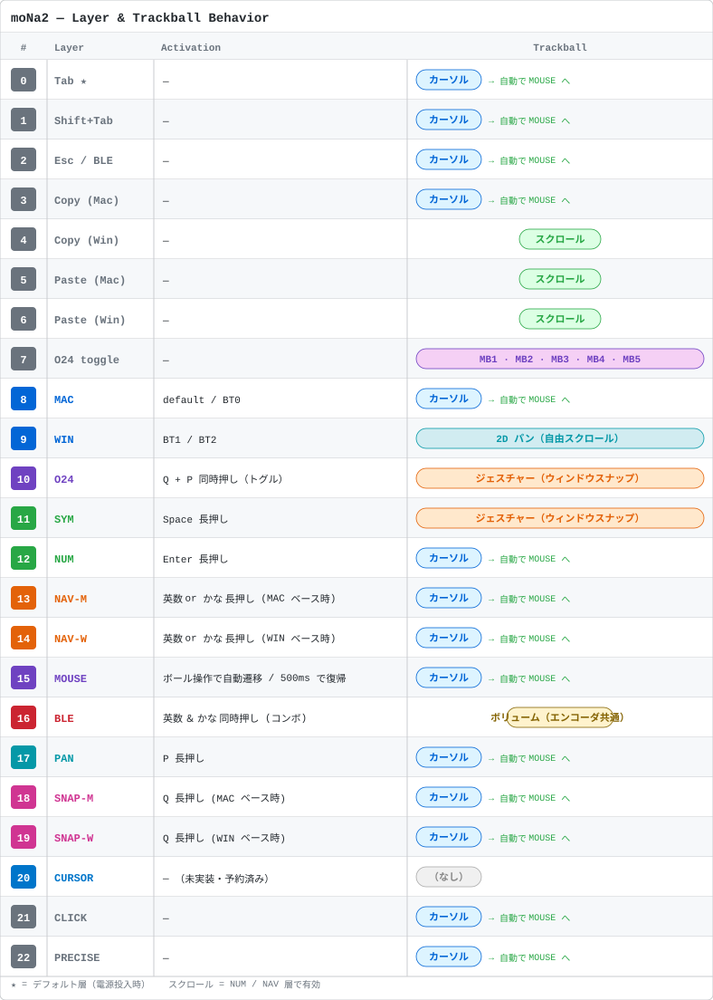
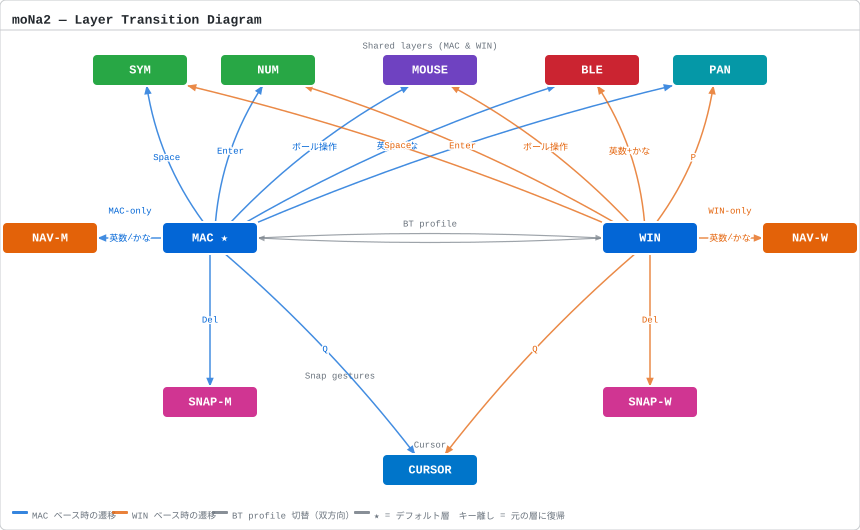

# キーマップ変更 は使えないと思っておいた方がいい（JIS対応＆特定レイヤでのキーマップ等が壊れうる）
https://nickcoutsos.github.io/keymap-editor/


# zmk-config-moNa2-v2

moNa2（右手トラックボール付き分割キーボード）用の ZMK キーマップ設定です。
**JIS運用 / Mac・Windows 切替 / DYA Studio 対応**。

---


---



---



---

## レイヤー構成

| # | 名称 | 起動方法 |
|---|---|---|
| 0 | **MAC** | デフォルト（電源投入時） |
| 1 | **WIN** | BT プロファイル連動で自動切替 |
| 2 | **O24**（代替レイアウト） | `Q`+`P` 同時押しでトグル |
| 3 | **SYM** 記号 | `Space` 長押し |
| 4 | **NUM** 数字 | `Enter` 長押し |
| 5 | **NAV-M** 矢印(Mac) | `英数` or `かな` 長押し（MAC ベース時） |
| 6 | **NAV-W** 矢印(Win) | `英数` or `かな` 長押し（WIN ベース時） |
| 7 | **MOUSE** | トラックボール操作で自動遷移（AML） |
| 8 | **BLE/設定** | `英数`+`かな` 同時押し |
| 9 | **GESTURE PAN** | `P` 長押し |
| 10 | **GESTURE SNAP (Mac)** | `Q` 長押し（MAC ベース時） |
| 11 | **GESTURE SNAP (Win)** | `Q` 長押し（WIN ベース時） |
| 12 | **CURSOR** | 未実装（予約済み） |
| 13 | **CLICK** | `Del` 長押し or `B` の一つ右（caps_word キー）長押し |

---

## 主な機能

### Mac / Windows 切替

BLE 層（`英数`+`かな` 同時押し）の最上段で切替：

| キー | 動作 |
|---|---|
| Y | BT0 → Mac モード |
| U | BT1 → Windows モード |
| I | BT2 → Windows モード |
| O / P | BT3 / BT4（層は手動切替） |

接続先を選ぶと **ベース層（MAC/WIN）が自動で切り替わり**ます。

---

### ロータリーエンコーダ（左ノブ）

| 使用中のレイヤー | ノブの動作 |
|---|---|
| MAC / WIN / SYM / NUM / MOUSE / GESTURE | スクロール（上下） |
| **NAV-M / NAV-W / BLE** | **音量調整** |

---

### トラックボール

| 状態 | 動作 |
|---|---|
| 通常 | マウスカーソル移動 |
| NUM / NAV 層中 | スクロール（慣性スクロール対応） |
| `P` 長押し中 | **パン**（2D 自由スクロール） |
| `Q` 長押し中 | **ウィンドウスナップ**（Rectangle / Win+矢印） |
| `Del` or `B`の一つ右 長押し中 | **クリック層**（カーソル移動しながら指でクリック） |

トラックボールを動かすと **MOUSE 層へ自動遷移**（AML）、500ms 静止で元に戻ります。

#### クリック層（CLICK）

`Del`（右手）または `B` の一つ右のキー（caps_word の位置・左手）を長押しすると **CLICK 層**に入ります。AML と独立しており、層中もトラックボールでカーソルは普通に動きます。片手で起動キーを押さえ、もう片方の手でクリックできます（タップ時は元の機能＝Del / caps_word）。

| 手 | キー | 動作 |
|---|---|---|
| 左 | `S` / `D` / `F` | 左クリック / 中クリック / 右クリック |
| 左 | `X` / `V` | 戻る / 進む |
| 右 | `J` / `K` / `L` | 左クリック / 中クリック / 右クリック |
| 右 | `M` / `.` | 戻る / 進む |

#### ウィンドウスナップ ジェスチャー

`Q` を押したままトラックボールを弾く方向でスナップ先が変わります：

| ストローク方向 | Mac（Rectangle） | Windows |
|---|---|---|
| ← | 左半分 | 左半分 |
| → | 右半分 | 右半分 |
| ↑ | 最大化 | 最大化 |
| ↓ | 中央（1/2） | 元のサイズに戻す |

> **斜め（↖↗↙↘）について**: キーマップ設定上は四隅スナップを定義しているが、利用中のジェスチャーモジュール（kot149/zmk-mouse-gesture）が上下左右の **4方向のみ**を認識する実装のため、現状は発火しない（既知の制限）。

> Mac は [Rectangle](https://rectangleapp.com/) が必要です（デフォルトショートカット `Ctrl+Option+矢印`）。

---

### コンボ

| 同時押し | 動作 |
|---|---|
| `S` + `D` | Tab |
| `D` + `F` | Shift + Tab |
| `J` + `K` | コピー（Mac: ⌘C / Win: Ctrl+C） |
| `K` + `L` | ペースト（Mac: ⌘V / Win: Ctrl+V） |
| `英数` + `かな` | tap = Esc / hold = BLE 層 |

---

### NAV 層（矢印・右手）

```
ESC  —   ↑   —   [Mission Control/タスクビュー]    —  [スクショW]  ↑  [スクショ範囲]  [スクショ全画面]
Home ←   ↓   →  End                           Mute  ←   ↓   →    —
Shift PgUp PgDn  —   —                              🔅  ⏮   ⏯   ⏭  🔆
```

左手は逆T字配列、右手は IJKL 逆T字＋メディアキー。

---

## 書き込み方法

1. このリポジトリへ push すると GitHub Actions が自動でファームウェアをビルド
2. Actions の完了後、実行ページ下部の **Artifacts > firmware** をダウンロード
3. `mona2_l-seeeduino_xiao_ble.uf2` → 左手、`mona2_r-seeeduino_xiao_ble.uf2` → 右手
4. **初回またはキーマップ構造を大きく変更した場合は `settings_reset.uf2` も先に書き込む**

---

## DYA Studio でのキーマップ変更

[DYA Studio](https://studio.dya.cormoran.works/) を使うと GUI でキーマップを変更できます。
接続前に BLE 層の `studio_unlock` キーを押してください（`L` の右隣）。

詳細: [`docs/keymap-phase1.md`](docs/keymap-phase1.md)

---

## COROPIT をお使いの方

`mona2_r.overlay` の以下の行のコメントアウトを外してください：

```dts
invert-x;
invert-y;
```

---

## 設計ドキュメント

詳細な設計思想・実装経緯・今後の拡張案: [`docs/keymap-phase1.md`](docs/keymap-phase1.md)

---

## 補足

- `boards/shields/mona2/mona2.keymap` は旧デフォルトキーマップ（7層）です。実際に動作するのは `config/mona2.keymap`（12層+O24）です。
